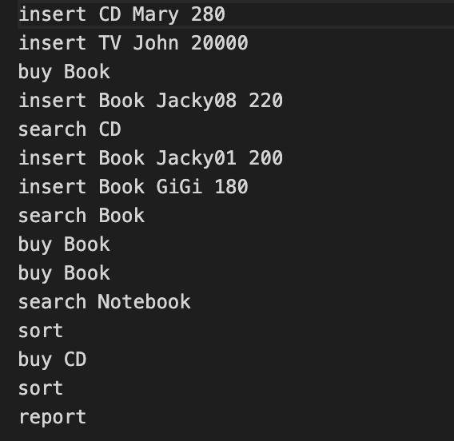
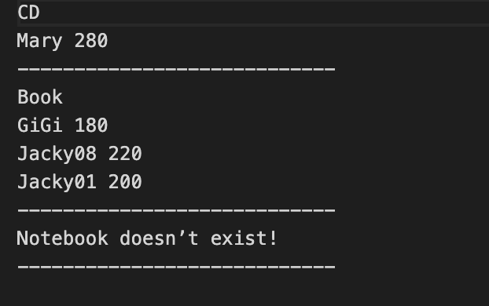
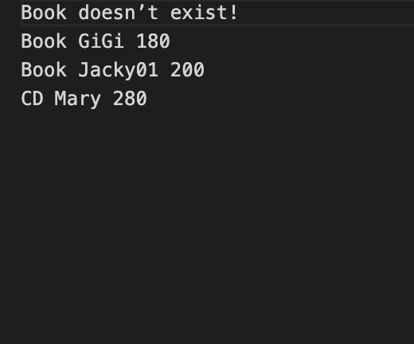
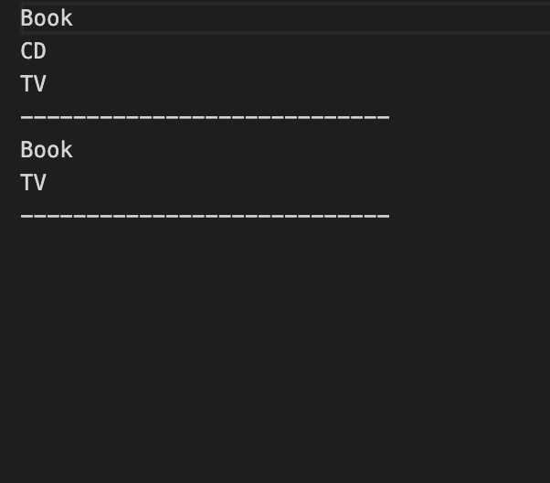
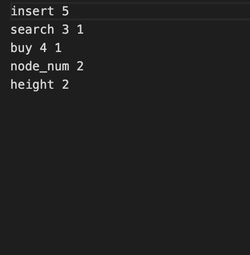

# seller-website-simulate
A project use bst and heap data structure to simulate the sellers and buyers' interaction.

Use <strong> binary search tree </strong> to store the sell items, and every item (every tree node) has its own <strong> min heap </strong> point to them in order to store the seller name and price. 

 

# Basic requirements

- <h2>Insert</h2>
    

    Insert items and sellers info. Process bst first. If    
    1. <strong><i>There is such item already exists:</i></strong> Put the seller info into the min heap which belongs to that item.
    2. <strong><i>There is no such item: </i></strong>Insert item into bst (based on the A-Z order, <strong>not CASE SENSITIVE</strong>), and also put the seller info into the min heap.

 

- <h2>Search</h2>

    Search item name. If
    1. <strong><i>Success:</i></strong> Put all the sellers info in this specific item into the <strong>search table</strong>.
    2. <strong><i>Failure: </i></strong>Put the search fail info into the <strong>search table</strong>.

 

- <h2>Buy</h2> 

    Buy a specific item. First, we have to search bst. If
    1. <strong><i>There is such item: </i></strong>It is assumed that the buyer considers the price of the product and chooses the product with the lowest price to buy, that is, take out the root of the min heap, and then store the transaction seller information (seller ID, product price) in the buyTable, and Delete the seller's information, and move the seller with the lowest selling price to the root. Assuming that there is no seller in the min heap, delete this item from the binary search tree.
    2. <strong><i> There is no such item: </i></strong> Put the failure info into the <strong>buy table</strong>.

 

- <h2>Sort</h2>

    Use <strong>inorder traversal</strong> to traverse the bst, and put the items into <strong>sort table</strong>.

 

- <h2>Report</h2>

    Ouput 4 files: searchTable.txt, buyTable.txt, sortTable.txt, LogTable.txt.

 

# Input format example

# Output format example

- <h2>Search table: </h2>

    

 

- <h2>Buy table: </h2>

    

 

- <h2>Sort table:</h2>

    

 

- <h2>Log table:</h2>

    
